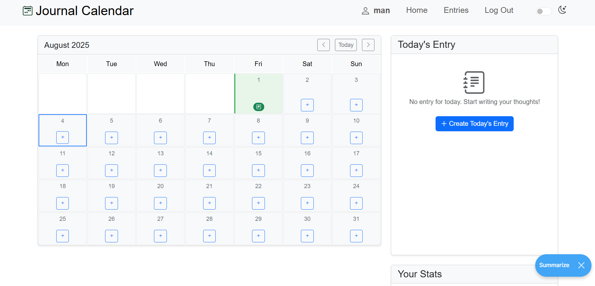
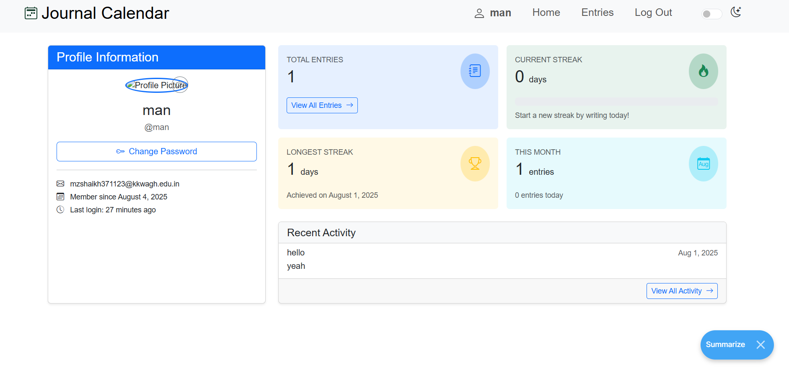
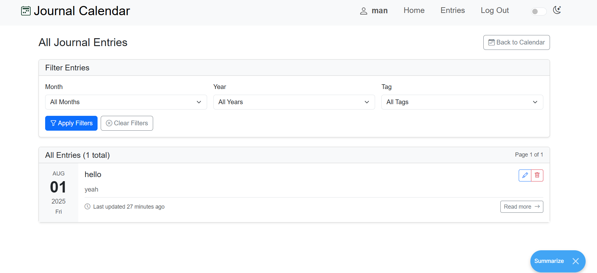

# Journal Calendar

A personal diary and journaling web application built with Django that helps you keep track of your daily thoughts, experiences, and memories.

## Features

- 📅 Calendar view of your journal entries
- ✍️ Rich text editor for journal entries
- 🔖 Tag and categorize your entries
- 🔒 User authentication and private entries
- 📱 Responsive design works on all devices

## Installation

1. **Clone the repository**:
   ```bash
   git clone https://github.com/zaidshaikh987/My_Journal_App.git
   cd My_Journal_App
   ```

2. **Set up a virtual environment**:
   ```bash
   python -m venv venv
   source venv/bin/activate  # On Windows: venv\Scripts\activate
   ```

3. **Install dependencies**:
   ```bash
   pip install -r requirements.txt
   ```

4. **Set up the database**:
   ```bash
   python manage.py migrate
   ```

5. **Create a superuser** (admin):
   ```bash
   python manage.py createsuperuser
   ```

6. **Run the development server**:
   ```bash
   python manage.py runserver
   ```

7. **Access the application**:
   ```
   http://127.0.0.1:8000/
   ```

## Usage

1. Register a new account or log in
2. Create your first journal entry
3. View your entries in calendar or list view
4. Edit or delete entries as needed

## Technologies Used

- Backend: Django 4.2
- Frontend: HTML5, CSS3, JavaScript, Bootstrap 5
- Database: SQLite (default, can be configured for PostgreSQL)

## Contributing

Contributions are welcome! Please feel free to submit a Pull Request.

## License

This project is licensed under the MIT License - see the LICENSE file for details.

## Models

- `models.py`: Defines the database models.

## Views

- `views.py`: Contains the view functions that handle different HTTP requests.
      - `asgi.py`
      - `settings.py`: project's and text editor's configuration file.
      - `urls.py`: Specifies the URL patterns and their corresponding views for the project.
      - `wsgi.py`
    - `.env`: Contains private information such as `SECRET_KEY` and `ENV_NAME`.
    - `.gitignore`: Defines the files to be ignored by Git.
    - `db.sqlite3`: Database used during the development phase.
    - `manage.py`
    - `README.md`: Contains the project's description and instructions.
    - `requirements.txt`: Lists all the Python packages that need to be installed to run the app.
  

## Running the Application
To run the **Journal** locally, follow these steps:

1. Install Python.
2. Clone the project repository.
3. Open a terminal and navigate to the project's main directory.
4. Create a file named `.env` and edit the file and enter these two lines:
    ```
    SECRET_KEY=''
    ENV_NAME=''
    ```
    _You can generate a test secret key [here](https://djecrety.ir/)._

5. Create a virtual environment (optional but recommended) and activate it.
6. Install the required Python packages by running the following command:
    ```
    pip install -r requirements.txt
    ```
7. Start the development server:
    ```
    python manage.py runserver
    ```
8. Access the app by visiting `http://localhost:8000` in a web browser of your choice.
9. Create a new account, and start using **Journal Calendar**.


## Screenshots

### Home Page


### Calendar View


### Entry Details


## Languages & Tools

- Python (Django Framework)
- JavaScript
- Bootstrap
- HTML
- CSS
- SQLite
- TinyMCE Text Editor

[Go Top ➚](#journal)
